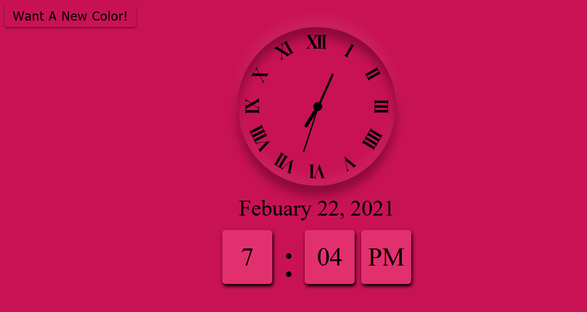
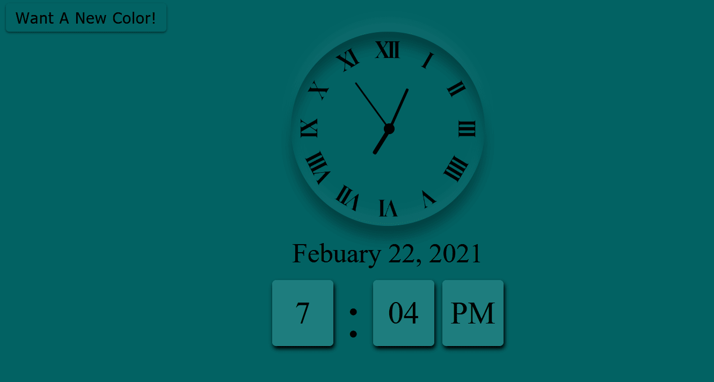
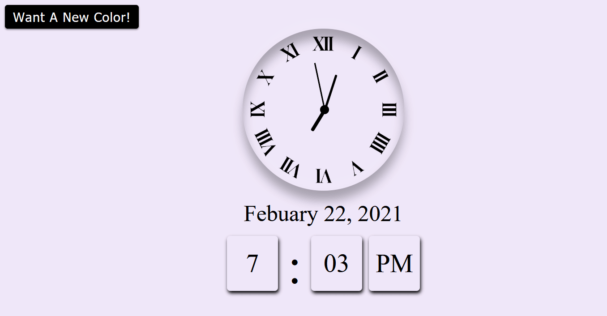

# JS_Clock
A clock created in Vanilla Javascript which provides accurate time along with the option to change the background to a random colour!

# Functionality
- Calculates the current time from the user's system and displays it on an analogue clock and digital clock
- Gives users the option to change the background to a random color
- the function that changes the background also changes the digital clock and button background to be a shade lighter than the main background for style

# Pictures of App

